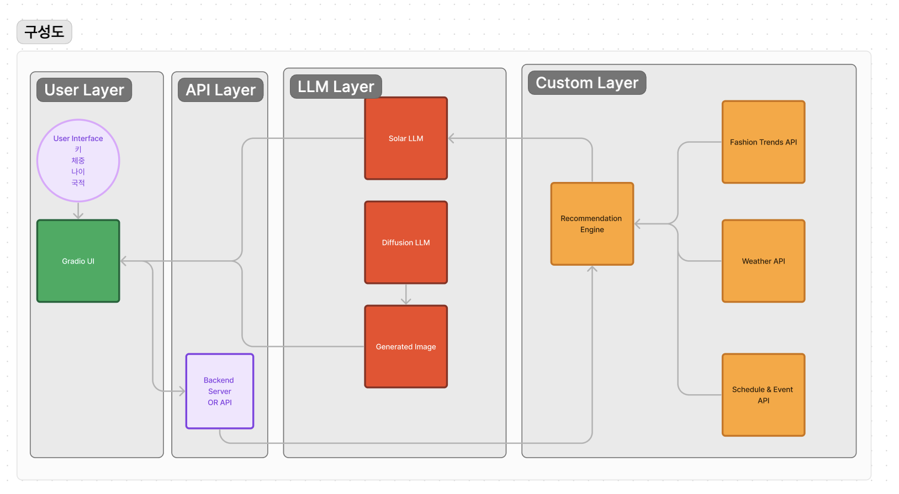

# Solar-LMM-Fashminator

## 개요

**Fashminator**는 사용자가 키, 체중, 나이 국적를 입력하면 날씨, 일정, 모임 목적에 맞춰 최신 패션 트렌드를 학습하여 최적의 옷을 추천해주는 시스템입니다. 추천 알고리즘을 향상시키기 위해 Solar LLM과 Diffusion LLM을 활용하며, Gradio를 사용하여 사용자 인터페이스를 제공합니다.


## 의논중인 문서
[의논중인 문서](https://docs.google.com/document/d/132_GdweLA4OVlep6Rywna2vfH2TXkhGr_9l2hu02ILo/edit?usp=sharing)

## 수집데이터
[학습데이터 소스]()


## 기능

- 사용자가 입력한 옷장 정보 관리
- 현재 날씨 정보를 기반으로 옷 추천
- 일정 및 모임 목적에 맞춘 옷 추천
- 최신 패션 트렌드를 반영한 옷 추천
- Solar LLM을 통한 추천 텍스트 생성
- Diffusion LLM을 통한 추천 이미지 생성
- Gradio를 통한 사용자 친화적인 인터페이스 제공

## 아키텍처 

서비스는 다음과 같은 구성 요소로 이루어져 있습니다:
1. **User Interface (UI)**: Gradio를 사용하여 사용자 입력을 받습니다.
2. **Weather API**: 날씨 정보를 제공합니다.
3. **Schedule & Event API**: 일정 및 모임 목적 정보를 제공합니다.
4. **Fashion Trends API**: 최신 패션 트렌드 데이터를 제공합니다.
5. **Solar LLM**: 텍스트 기반의 추천을 제공합니다.
6. **Diffusion LLM**: 이미지 기반의 추천을 제공합니다.
7. **Recommendation Engine**: Solar LLM과 Diffusion LLM을 통합하여 최적의 옷을 추천합니다.
9. **Backend Server**: 각 구성 요소를 연결하고 데이터를 처리합니다.


## 구성도 



## 유저 흐름

```
사용자 -------------------------
     | (웹 브라우저 접속)
     V
Gradio UI ----------------------
     | (키, 체중, 나이, 국적 입력)
     V
"제출" 버튼 클릭 ---------------
     | (정보 전달)
     V
solar_lmm_fashminator 실행 -----
     | (추천 옷 텍스트 생성)
     V
generate_outfit_image 실행 -----
     | (DALL·E API 호출)
     V
Gradio UI ----------------------
     | (추천 옷 텍스트와 이미지 표시)
     V
사용자 -------------------------
     | (결과 확인 및 추가 입력)
     V
(반복)
```

## 설치 및 실행

1. **클론 저장소**:
   ```bash
   git clone https://github.com/username/fashminator.git
   cd fashminator
